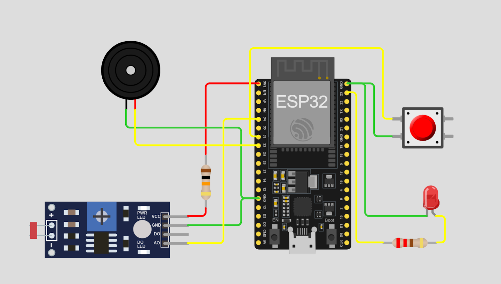
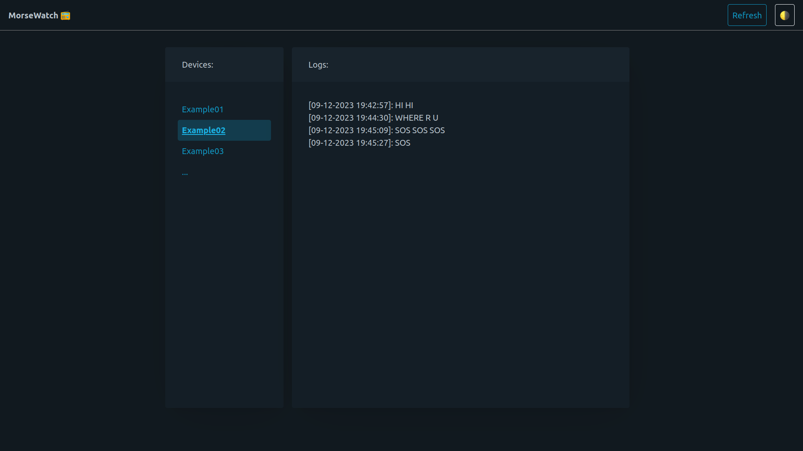

# MorseWatch

An ESP32 Morse code decoder, which is also an IoT device for reporting emergency signals.




## Running the server:
```
go get github.com/gin-gonic/gin
go get github.com/gin-contrib/cors
go run main.go
```
